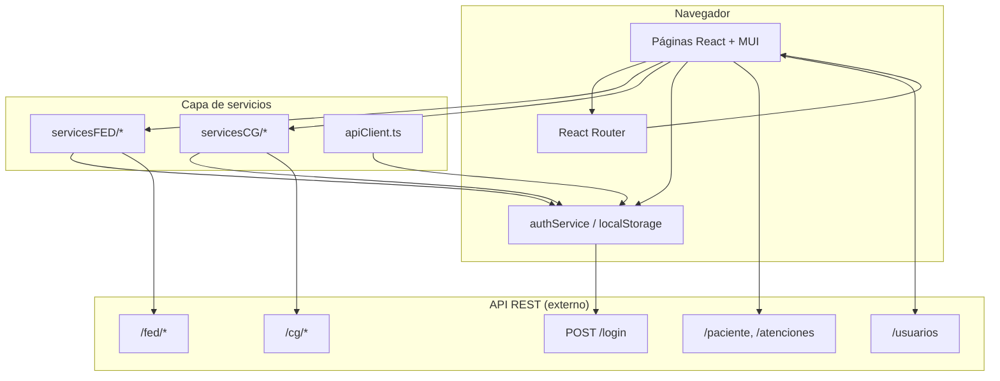
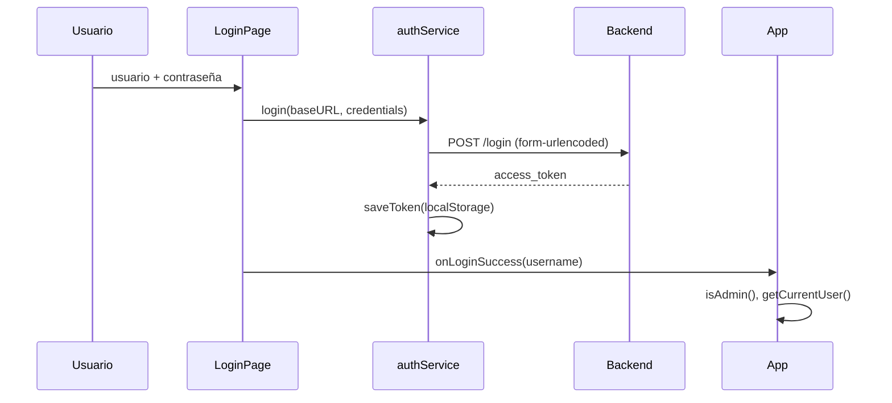

# Arquitectura del frontend

Este documento describe cómo está organizada la aplicación, cómo fluyen los datos y qué convenciones seguir al extender el sistema.

---

## Visión general



La aplicación es una **SPA (Single Page Application)** sin servidor Node en producción: solo archivos estáticos tras `vite build`.

---

## Capas

### 1. Punto de entrada (`main.tsx`)

Monta la aplicación en `#root` con `StrictMode` de React.

### 2. Shell de aplicación (`App.tsx`)

Responsabilidades:

- Proveer el **tema MUI** (`ThemeProvider` + `CssBaseline`).
- Definir **todas las rutas** con `BrowserRouter`.
- Mantener estado global ligero: `authenticated`, `currentUser`, `userIsAdmin`.
- Componente **`RequireAuth`**: redirige a `/login` si no hay token.

No usa Context API para auth; el estado vive en `App` y se pasa por props a `AppLayout` y `LoginPage`.

### 3. Layout (`components/layout/`)

| Componente | Función |
|----------|---------|
| `AppLayout` | Estructura: header fijo, sidebar, área de contenido (`<Outlet />`), footer |
| `Header` | Usuario actual, botón cerrar sesión, toggle menú móvil |
| `Sidebar` | Navegación; filtra ítems `adminOnly` según rol |
| `Footer` | Pie institucional |

El ancho del drawer lateral es **240px** (`DRAWER_WIDTH`).

### 4. Páginas (`pages/`)

Contienen lógica de presentación: estado local, efectos, composición de MUI Data Grid y Recharts. Las páginas FED suelen ser extensas porque incluyen:

- Selectores en cascada (año, mes, departamento, provincia, red, microred, categoría).
- Dos modos de vista: **territorial** vs **redes**.
- Tablas jerárquicas colapsables + gráfico de resumen anual.

### 5. Servicios (`services/`)

Encapsulan `fetch` hacia el backend. La mayoría de servicios FED repiten el mismo patrón:

```typescript
const BASE = `${API_CONFIG.baseURL}/fed/si0101`;

async function apiFetch<T>(url: string, signal?: AbortSignal): Promise<T> {
  const response = await fetch(url, {
    headers: { ...authHeader() },
    signal,
  });
  if (response.status === 401) throw new Error('Sesión expirada');
  // ...
  return response.json();
}

export const fedSI0101Service = {
  getFiltros: (signal?) => apiFetch(`${BASE}/filtros`, signal),
  getTablaCompleta: (params, signal?) => /* ... */,
  getTablaRedes: (params, signal?) => /* ... */,
  getResumen: (params, signal?) => /* ... */,
};
```

**`apiClient.ts`** ofrece un `apiFetch` genérico con callback `onUnauthorized`; hoy muchas páginas usan `fetch` directo o helpers locales duplicados — al crear código nuevo, priorice reutilizar `apiClient` o extraer el helper común.

**`configFedService`** consulta `/config/fed/all` para mostrar en cabeceras de reportes las fuentes de datos (HISMINSA, CNV, etc.) y sus fechas de corte.

### 6. Hooks (`hooks/`)

| Hook | Estado |
|------|--------|
| `useAuth` | Implementación alternativa del flujo de login; **no está cableado en `App.tsx`** actualmente (la app usa estado en `App` + `authService` directo). Útil si se refactoriza a Context. |
| `useApiFetch` | Wrapper de `fetch` con logout en 401 |

### 7. Tipos (`types/index.ts`)

Interfaces compartidas: `Paciente`, `Atencion`, `User`, `NotificationState`. Los servicios FED definen sus propios tipos en cada archivo `.ts` del servicio.

### 8. Tema (`theme/index.ts`)

Paleta institucional azul (`#1565C0`), tipografía **DM Sans**, bordes redondeados. Los componentes MUI heredan estos estilos globalmente.

---

## Flujo de autenticación



**Logout:** `removeToken()` y reset de estado en `App`.

**401:** Los servicios lanzan `'Sesión expirada'`. Algunas páginas muestran alerta; no hay redirección automática global salvo que se registre `setUnauthorizedHandler` en `apiClient`.

---

## Enrutamiento

- Rutas públicas: `/login`
- Rutas protegidas: envueltas en `RequireAuth` + `AppLayout` (layout anidado con `<Outlet />`)
- Default autenticado: `/` → `/pacientes`
- Catch-all `*`: redirige a `/pacientes` o `/login`

Las rutas de reportes usan alias cortos (`fed01` … `fed016`) mapeados a componentes con nombres de indicador real (`FedMC0101Page`, etc.).

---

## Patrón de un reporte FED típico

1. **Montaje:** `useEffect` llama a `getFiltros()` y rellena combos.
2. **Aplicar filtros:** el usuario elige año/mes y dimensiones; se dispara `getTablaCompleta` o `getTablaRedes`.
3. **Presentación:**
   - Filas agregadas por provincia/red con filas hijas colapsables (distritos / establecimientos).
   - Chips de color según umbral de avance (≥80 % verde, ≥50 % ámbar, resto rojo).
   - Gráfico de barras con `getResumen` para serie histórica mensual.
4. **Cancelación:** muchas llamadas aceptan `AbortSignal` para evitar condiciones de carrera al cambiar filtros rápidamente.

---

## Consideraciones de seguridad

- El JWT en `localStorage` es vulnerable a XSS; mantenga dependencias actualizadas y evite `dangerouslySetInnerHTML`.
- No almacene contraseñas en el cliente.
- En producción use HTTPS y tokens con expiración razonable en el backend.
- La autorización de reportes depende del menú y del rol en el token; refuerce controles en el API.

---

## Extender el sistema

### Nuevo reporte FED

1. Crear `src/services/servicesFED/fedNuevoService.ts` con `BASE = .../fed/codigo`.
2. Crear `src/pages/FED/FedNuevoPage.tsx` (copiar estructura de un indicador similar).
3. Registrar ruta en `App.tsx`.
4. Añadir entrada en `navItems` de `Sidebar.tsx`.
5. Documentar endpoints en `docs/API-BACKEND.md` y fila en `docs/MODULOS-Y-RUTAS.md`.

### Nuevo reporte CG

Misma secuencia usando `servicesCG/` y `pages/CG/`.

---

## Dependencias entre frontend y backend

El frontend **asume** respuestas JSON con campos en español o mayúsculas según el origen (p. ej. `DEPARTAMENTO`, `DISTRITO | PROVINCIA`). Cualquier cambio de contrato en el API debe actualizarse en el servicio y en las columnas del DataGrid correspondientes.
