# Arquitectura del sistema — GERESA Convenios

## Objetivo

Describir la arquitectura real del monorepo (Frontend SPA + Backend API + Deploy), mapeando componentes a conceptos clásicos (MVC/capas) **sin inventar** capas que no existen en el código.

## Alcance

- Patrón general del sistema
- Mapeo MVC (aproximación, no framework MVC formal)
- Capas, flujo de datos, dependencias
- Controladores, modelos, vistas, helpers, servicios, bibliotecas
- Carga / manejo de archivos observado

**Fuera de alcance:** microservicios, CQRS, event sourcing — **no aplican** a este repo.

## Responsabilidades

| Componente | Responsabilidad |
|------------|-----------------|
| `Frontend/` | UI, rutas, JWT en navegador, llamadas HTTP |
| `Backend/` | API, auth/RBAC, SQL, generación PDF |
| `deploy/` | Contenedores y proxy nginx |
| SQL Server | Persistencia (fuera del repo) |

## Dependencias (documentales)

- `docs/PROJECT_INDEX.md` — inventario estructural
- `docs/02-arquitectura.md` — resumen previo
- Código en `Frontend/src/`, `Backend/`, `deploy/`

## Archivos relacionados

| Archivo | Rol arquitectónico |
|---------|-------------------|
| `Frontend/src/App.tsx` | Composition root (providers) |
| `Frontend/src/AppRoutes.tsx` | Enrutado + guards |
| `Frontend/src/services/*` | Acceso HTTP |
| `Backend/main.py` | Entry ASGI |
| `Backend/app/factory.py` | App + CORS |
| `Backend/app/api/router.py` | Montaje de routers |
| `Backend/database.py` | Acceso SQL |
| `deploy/docker-compose.yml` | Topología runtime prod |

## Riesgos

- Documentar el Backend como “MVC limpio” oculta que la lógica SQL vive en los routers (controladores gordos).
- `Frontend/docs/ARQUITECTURA.md` está parcialmente desfasada respecto al código actual.

## Mejoras posibles

- Extraer capa de servicios/repositorios en Backend.
- Unificar cliente HTTP en Frontend (`apiClient`).
- Usar React Query de forma real o retirarlo.

---

## 1. Patrón de arquitectura

### Patrón real observado

**Monorepo cliente–servidor en capas**, con:

1. **SPA (Single Page Application)** — React + Vite  
2. **API REST monolítica** — FastAPI (una sola aplicación ASGI)  
3. **Persistencia compartida** — SQL Server multi-base vía ODBC  
4. **Edge de despliegue** — nginx (estáticos + reverse proxy `/api`)

No es:

- Microservicios  
- BFF dedicado  
- MVC server-side clásico (Rails/Django templates)  
- Clean Architecture completa (no hay capa domain/application aislada en Backend)

### Diagrama de contexto

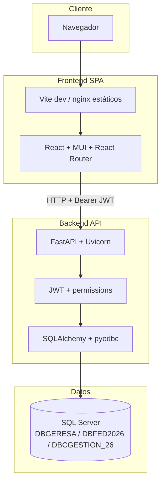

### Producción (proxy)

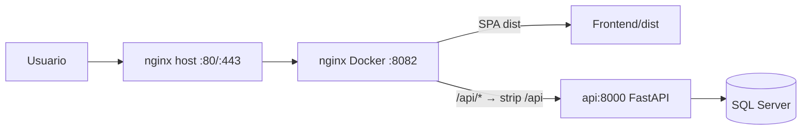

---

## 2. MVC (mapeo conceptual)

El proyecto **no usa un framework MVC**. Se puede mapear así:

| Rol MVC | Frontend | Backend |
|---------|----------|---------|
| **Vista (View)** | `pages/*`, `components/*` | **No aplica** (API JSON/PDF, sin templates HTML) |
| **Controlador (Controller)** | Handlers de eventos en Pages + guards en `AppRoutes` | Routers FastAPI (`app/api/routes/*`, `FED/*`, `cg_10.py`, …) |
| **Modelo (Model)** | `types/index.ts`, estado en Context/hooks locales | Pydantic (`models.py`) + filas SQL (sin ORM entities) |

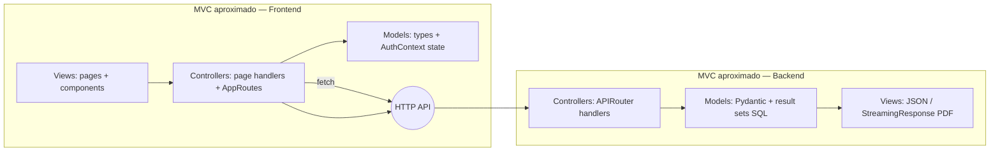

**Conclusión MVC:** híbrido **SPA + API**. El Backend concentra Controller+Model; la Vista está casi toda en React.

---

## 3. Capas

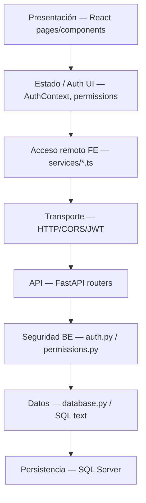

| Capa | Existe | Ubicación |
|------|--------|-----------|
| Presentación UI | Sí | `Frontend/src/pages`, `components` |
| Estado de sesión | Sí | `context/AuthContext.tsx` |
| Servicios HTTP FE | Sí | `Frontend/src/services` |
| API / Controllers BE | Sí | `Backend/app/api`, `FED/`, raíces `*_py` |
| Servicios de dominio BE | **No** | Lógica dentro de routers |
| Repositorios / DAO | **No** como capa | SQL embebido en handlers |
| ORM models | **No** | Solo Pydantic + `text()` SQL |
| Infra deploy | Sí | `deploy/` |

---

## 4. Flujo de datos

### 4.1 Login

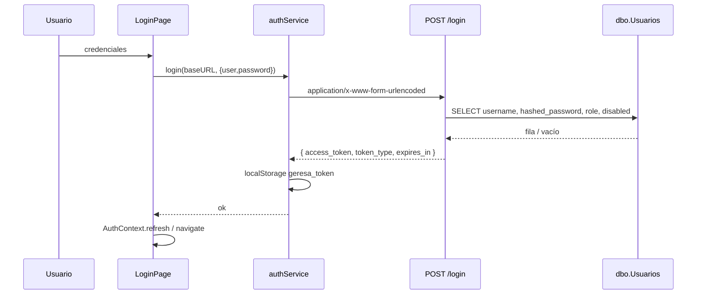

### 4.2 Consulta de reporte (FED/CG) autenticada

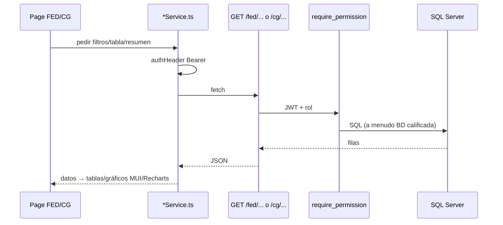

### 4.3 Pacientes / atenciones

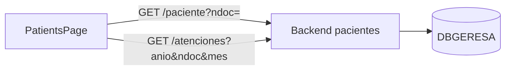

---

## 5. Dependencias (entre componentes)

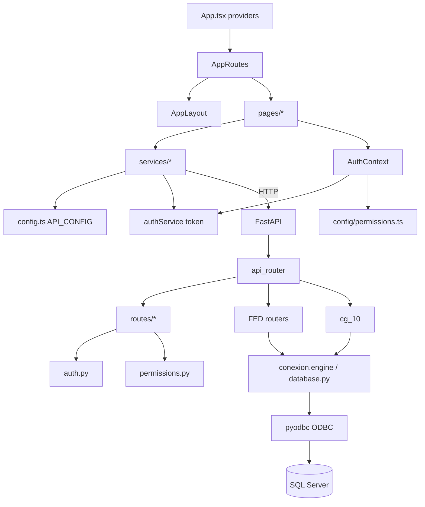

### Dependencias runtime externas

| Componente | Depende de |
|------------|------------|
| Frontend | Backend HTTP alcanzable + CORS |
| Backend | SQL Server + Driver ODBC + `SECRET_KEY` |
| Deploy nginx | `Frontend/dist` build + contenedor `api` |

---

## 6. Controladores

### Backend (APIRouter = controladores)

| Controlador / módulo | Prefijo / rutas | Archivo |
|----------------------|-----------------|---------|
| Auth | `/login`, `/me` | `app/api/routes/auth.py` |
| Usuarios | `/usuarios` | `app/api/routes/users.py` |
| Pacientes | `/paciente`, `/atenciones` | `app/api/routes/pacientes.py` |
| Certificados | `/certificado/` | `app/api/routes/certificados.py` |
| Config FED | `/config/fed` | `app/api/routes/config_fed.py` |
| FED indicadores | `/fed/mc*`, `/fed/si*`, `/fed/vi*`, … | `FED/*`, `fed_mc_01_01.py`, `his_diario.py` |
| CG-10 | `/cg/cg10` | `cg_10.py` |

Montaje: `app/api/router.py` + registries `fed/registry.py`, `cg/registry.py`.

### Frontend (control de flujo UI)

| Pieza | Función de “controlador” |
|-------|--------------------------|
| `AppRoutes.tsx` | Rutas, lazy load, `RequireAuth`, `RequirePermission` |
| `*Page.tsx` | Orquesta UI + llamadas a services |
| `AuthContext.tsx` | Login/logout/can |
| `Sidebar.tsx` | Filtrado de menú por permisos |

---

## 7. Modelos

### Backend

| Modelo | Tipo | Archivo |
|--------|------|---------|
| `LoginRequest` | Pydantic | `Backend/models.py` |
| `TokenResponse` | Pydantic | `Backend/models.py` |
| `UserInDB` | Pydantic | `Backend/models.py` |
| Modelos locales en routers | Pydantic / dicts | p.ej. `config_fed.py` y módulos FED |
| Entidades SQLAlchemy ORM | **No existen** | — |
| Esquema BD versionado | **No existe** en repo | tablas en SQL Server |

### Frontend

| Modelo / tipo | Archivo |
|---------------|---------|
| `Paciente`, `Atencion`, `User`, `NotificationState` | `Frontend/src/types/index.ts` |
| `AppRole` y tipos de auth | `Frontend/src/services/authService.ts` |
| Tipos locales por service FED/CG | dentro de cada `*Service.ts` |

---

## 8. Vistas

Todas las vistas HTML/UI están en el Frontend:

| Vista | Archivo |
|-------|---------|
| Login | `pages/LoginPage.tsx` |
| Pacientes | `pages/PatientsPage.tsx` |
| Admin usuarios | `pages/AdminUsersPage.tsx` |
| 403 | `pages/ForbiddenPage.tsx` |
| Reportes FED | `pages/FED/*.tsx` (16) |
| Reportes CG | `pages/CG/CG10Page.tsx` |
| Shell layout | `components/layout/*` |
| UI auxiliar | `components/ui/InfoCard.tsx` |

Backend **no** renderiza vistas HTML; responde JSON o PDF (`StreamingResponse`).

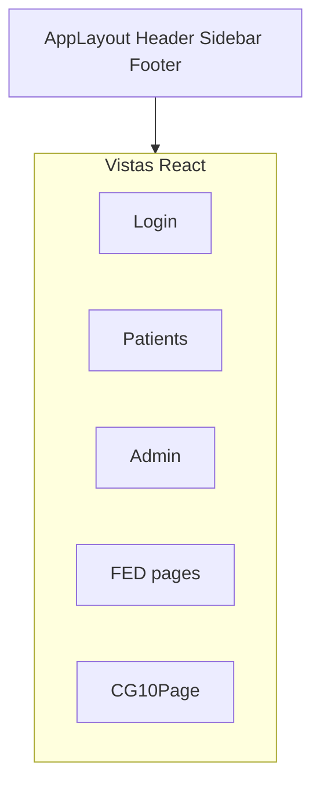

---

## 9. Helpers

| Buscado | Resultado |
|---------|-----------|
| Carpetas `helpers/`, `utils/` | **No existen** |
| Hooks utilitarios | `hooks/useInactivityLogout.ts` (único hook dedicado) |
| Helpers de permisos | `config/permissions.ts` (`hasPermission`, `getDefaultRoute`) |
| Compat BD | `conexion.py` (reexport de `database.py`) |
| Factory app | `app/factory.py` |

No hay una librería interna de “helpers” compartida; las utilidades están repartidas en config/auth/hooks.

---

## 10. Servicios

### Frontend — sí hay capa `services/`

| Servicio | Archivo |
|----------|---------|
| Auth | `services/authService.ts` |
| Cliente HTTP genérico | `services/apiClient.ts` (poco usado por módulos) |
| FED | `services/servicesFED/*` |
| CG | `services/servicesCG/cgCG10Service.ts` |

Patrón habitual FED/CG: cada archivo define `BASE` + `apiFetch` local + funciones `getFiltros` / `getTabla…` / `getResumen`.

### Backend — capa services **no existe**

La orquestación y el SQL viven en los handlers de los routers. No hay `Backend/services/` ni repositorios.

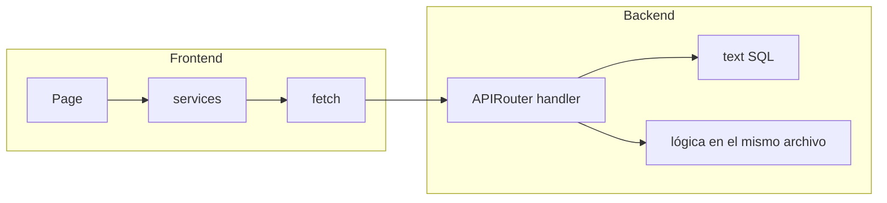

---

## 11. Bibliotecas

### Frontend (runtime)

React, React DOM, React Router, MUI + Icons + X Data Grid, Emotion, Recharts, TanStack React Query.

Build: Vite, TypeScript.

### Backend (runtime principal)

FastAPI, Starlette, Uvicorn, Pydantic, SQLAlchemy, pyodbc, python-decouple, python-jose, passlib/bcrypt, python-multipart, PyPDF2, reportlab, pandas/numpy.

### Deploy

Docker / Compose, nginx, imagen `python:3.11-slim` + ODBC 18.

Detalle de versiones: `Frontend/package.json`, `Backend/requirements.txt`.

---

## 12. Carga de archivos

### Upload desde el cliente → API

| Mecanismo | Estado |
|-----------|--------|
| `UploadFile` / multipart file upload | **No encontrado** en Backend |
| Input `type="file"` como flujo de negocio documentado | **No detectado** como módulo de carga |

El login usa `OAuth2PasswordRequestForm` (campos form, no archivo).

### Lectura / generación de archivos en servidor

| Flujo | Existe | Detalle |
|-------|--------|---------|
| Leer plantilla PDF | Sí | `Backend/Plantillas/certificado.pdf` leída por `certificados.py` |
| Generar PDF de salida | Sí | PyPDF2 + reportlab → `StreamingResponse` |
| Servir estáticos Frontend | Sí | Vite/`dist` o nginx `Frontend/dist` |
| Almacenar uploads de usuario | **No existe** en el código revisado |

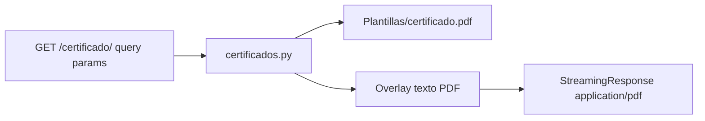

---

## 13. Composition root Frontend

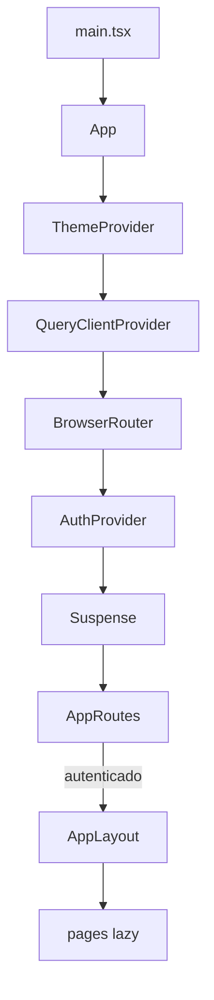

---

## 14. Resumen ejecutivo

| Pregunta | Respuesta factual |
|----------|-------------------|
| ¿Qué patrón es? | SPA + API REST monolítica + SQL Server |
| ¿Es MVC puro? | No; mapeo aproximado SPA/API |
| ¿Hay capa services en Backend? | No |
| ¿Hay capa services en Frontend? | Sí (`src/services`) |
| ¿Hay helpers centralizados? | No (utils dispersos) |
| ¿Hay upload de archivos? | No observado |
| ¿Hay generación de archivos? | Sí (PDF certificado) |
| ¿Dónde está la vista? | React (`pages` + `components`) |
| ¿Dónde está el controlador BE? | Routers FastAPI |

---

## Enlaces

- Índice estructural: [PROJECT_INDEX.md](./PROJECT_INDEX.md)
- Endpoints: [05-api-endpoints.md](./05-api-endpoints.md)
- Auth: [06-autenticacion-y-autorizacion.md](./06-autenticacion-y-autorizacion.md)
- BD: [07-base-de-datos.md](./07-base-de-datos.md)
- Deploy: [10-despliegue.md](./10-despliegue.md)
