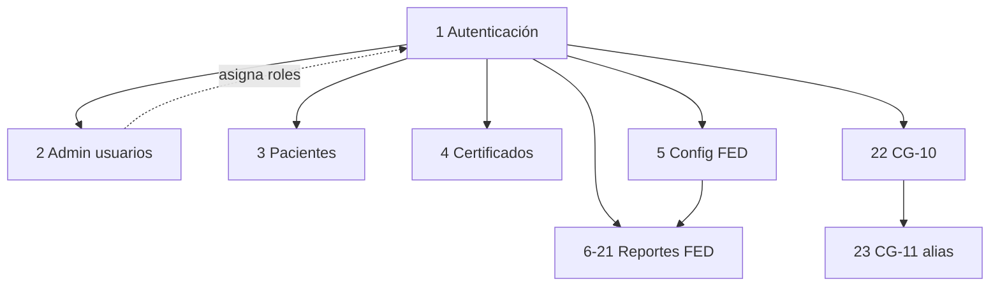

# Módulos funcionales del sistema

## Objetivo

Inventariar los **módulos funcionales existentes** en Frontend y Backend, con sus responsabilidades, dependencias y permisos.

## Alcance

Solo módulos con evidencia en rutas UI (`AppRoutes.tsx` / `Sidebar.tsx`) y/o routers API montados.

**No documentados como módulos de negocio** (infraestructura): layout (`AppLayout`, Header, Sidebar, Footer), tema MUI, `QueryClient`, páginas `ForbiddenPage` / loader.

## Índice de módulos existentes

| # | Módulo | UI | API |
|---|--------|----|-----|
| 1 | Autenticación y sesión | Sí | Sí |
| 2 | Administración de usuarios | Sí | Sí |
| 3 | Consulta de pacientes y atenciones | Sí | Sí |
| 4 | Certificados PDF | **No** (solo API) | Sí |
| 5 | Configuración FED (fuentes) | Consumida por reportes FED | Sí |
| 6–21 | Reportes FED (16 indicadores) | Sí | Sí |
| 22 | Convenio CG-10 Salud Bucal | Sí | Sí |
| 23 | Convenio CG-11 (alias UI) | Sí (misma vista/API que CG-10) | No propio |

---

## 1. Autenticación y sesión

| Campo | Contenido |
|-------|-----------|
| **Nombre** | Autenticación y sesión |
| **Objetivo** | Identificar al usuario, emitir JWT y mantener sesión en el cliente |
| **Responsabilidad** | Login, validación de token, logout por inactividad, exponer rol/permisos en UI |
| **Dependencias** | Tabla `Usuarios`, `SECRET_KEY`, `authService`, `AuthContext` |
| **Archivos involucrados** | `Backend/app/api/routes/auth.py`, `Backend/auth.py`, `Backend/models.py`, `Frontend/src/pages/LoginPage.tsx`, `Frontend/src/services/authService.ts`, `Frontend/src/context/AuthContext.tsx`, `Frontend/src/hooks/useInactivityLogout.ts` |
| **Controladores** | `POST /login`, `GET /me`; guards `RequireAuth` |
| **Modelos** | `TokenResponse`, `UserInDB`, `LoginRequest` (Pydantic); payload JWT `sub`/`role`/`exp` |
| **Vistas** | `LoginPage.tsx` |
| **Base de datos** | `dbo.Usuarios` / `Usuarios` (`username`, `hashed_password`, `role`, `disabled`) |
| **API** | `POST /login`, `GET /me` |
| **Permisos** | Login público; `/me` requiere Bearer |
| **Riesgos** | Sin tabla `Usuarios` → 500; token en `localStorage`; sin refresh token |
| **Relación con otros módulos** | Prerrequisito de todos los módulos autenticados |

---

## 2. Administración de usuarios

| Campo | Contenido |
|-------|-----------|
| **Nombre** | Administración de usuarios |
| **Objetivo** | CRUD de usuarios de la aplicación |
| **Responsabilidad** | Listar, crear, editar y eliminar usuarios y roles |
| **Dependencias** | Autenticación; rol `admin`; bcrypt (`pwd_context`) |
| **Archivos involucrados** | `Backend/app/api/routes/users.py`, `Frontend/src/pages/AdminUsersPage.tsx`, `Backend/permissions.py` (`require_admin`) |
| **Controladores** | Router `/usuarios`; `AdminUsersPage` handlers |
| **Modelos** | Filas `id`, `username`, `role`; UI tipo `User` en `types/index.ts` |
| **Vistas** | `AdminUsersPage.tsx` |
| **Base de datos** | `dbo.Usuarios` |
| **API** | `GET/POST /usuarios`, `PUT/DELETE /usuarios/{user_id}` |
| **Permisos** | Backend: `require_admin`. Frontend ruta: `admin:users` (cubierto por rol `admin` con `*`) |
| **Riesgos** | Solo admin; errores genéricos al crear usuario duplicado |
| **Relación con otros módulos** | Define roles que habilitan FED/CG/Pacientes |

---

## 3. Consulta de pacientes y atenciones

| Campo | Contenido |
|-------|-----------|
| **Nombre** | Consulta de pacientes y atenciones |
| **Objetivo** | Buscar paciente por documento y listar atenciones HIS |
| **Responsabilidad** | Consulta paginada de atenciones por año/mes/documento |
| **Dependencias** | Autenticación; permiso `pacientes:read`; BD GERESA |
| **Archivos involucrados** | `Backend/app/api/routes/pacientes.py`, `Frontend/src/pages/PatientsPage.tsx`, `Frontend/src/types/index.ts` |
| **Controladores** | Endpoints pacientes; lógica en `PatientsPage` |
| **Modelos** | `Paciente`, `Atencion` (TypeScript); result sets SQL |
| **Vistas** | `PatientsPage.tsx` |
| **Base de datos** | `MAESTRO_PACIENTE`, `MAESTRO_HIS_TIPO_DOC`, `DBGERESA.dbo.HISMINSA`, `RENIPRESS`, `MAESTRO_HIS_CIE_CPMS`, `MAESTRO_HIS_SISTEMA`, `MAESTRO_REGISTRADOR` |
| **API** | `GET /paciente?ndoc=`, `GET /atenciones?anio&ndoc&mes&offset&per_page` |
| **Permisos** | `pacientes:read` (roles: admin, fed, cg, atenciones, user) |
| **Riesgos** | Consultas pesadas sobre HIS; depende de calidad de maestros |
| **Relación con otros módulos** | Independiente de reportes FED/CG; comparte auth |

---

## 4. Certificados PDF

| Campo | Contenido |
|-------|-----------|
| **Nombre** | Certificados PDF |
| **Objetivo** | Generar PDF de certificado a partir de plantilla |
| **Responsabilidad** | Componer PDF (plantilla + textos) y devolverlo en streaming |
| **Dependencias** | Usuario autenticado; archivo `Plantillas/certificado.pdf`; PyPDF2, reportlab |
| **Archivos involucrados** | `Backend/app/api/routes/certificados.py`, `Backend/Plantillas/certificado.pdf` |
| **Controladores** | `GET /certificado/` |
| **Modelos** | Parámetros query (`nombre`, `calidad`, `fecha`, `folio`, `numero`) — sin modelo Pydantic dedicado en `models.py` |
| **Vistas** | **No existe** página Frontend que consuma este endpoint |
| **Base de datos** | **No usa** tablas; solo archivo PDF local |
| **API** | `GET /certificado/?nombre&calidad&fecha&folio&numero` |
| **Permisos** | Cualquier usuario autenticado (`get_current_user`) |
| **Riesgos** | Ruta de plantilla relativa al CWD; sin UI, solo usable vía API/docs |
| **Relación con otros módulos** | Solo auth; no enlazado al menú |

---

## 5. Configuración FED (fuentes de datos)

| Campo | Contenido |
|-------|-----------|
| **Nombre** | Configuración FED |
| **Objetivo** | Exponer fuentes/fechas de datos FED para cabeceras de reportes |
| **Responsabilidad** | Listar registros de configuración FED |
| **Dependencias** | Auth; `DBFED2026.dbo.Config` |
| **Archivos involucrados** | `Backend/app/api/routes/config_fed.py`, `Frontend/src/services/servicesFED/configFedService.ts` |
| **Controladores** | `GET /config/fed/all` |
| **Modelos** | `ConfigFedItem`, `ConfigFedResponse` (en el router) |
| **Vistas** | Sin página propia; datos usados por páginas FED |
| **Base de datos** | `DBFED2026.dbo.Config` |
| **API** | `GET /config/fed/all` |
| **Permisos** | Usuario autenticado |
| **Riesgos** | Si `Config` está vacía, headers FED sin fechas |
| **Relación con otros módulos** | Soporte transversal a reportes FED |

---

## 6–21. Reportes FED

Patrón común (salvo HIS y Oportunidad):

- **Permisos:** `fed:read`
- **API típica:** `/filtros`, `/tabla-completa`, `/tabla-redes`, `/resumen`
- **BD:** `DBFED2026.dbo.*`
- **Relación:** Auth + Config FED; menú «Reportes FED»

### 6. FED MC-01.01

| Campo | Contenido |
|-------|-----------|
| **Nombre** | FED MC-01.01 |
| **Objetivo** | Reporte de indicador MC-01.01 (nominales gestantes según cabecera del módulo) |
| **Responsabilidad** | Filtros, tablas geo/redes y resumen mensual |
| **Dependencias** | `fed:read`, tabla `IRVIN_FED_MC_01_01` |
| **Archivos involucrados** | `Backend/fed_mc_01_01.py`, `Frontend/src/pages/FED/FedMC0101Page.tsx`, `Frontend/src/services/servicesFED/fedMC0101Service.ts` |
| **Controladores** | Router `/fed/mc0101` |
| **Modelos** | Result sets SQL; tipos locales en service |
| **Vistas** | `FedMC0101Page.tsx` — ruta `/reportesFED/fed01` |
| **Base de datos** | `DBFED2026.dbo.IRVIN_FED_MC_01_01` |
| **API** | `/fed/mc0101/{filtros,tabla-completa,tabla-redes,resumen}` |
| **Permisos** | `fed:read` |
| **Riesgos** | Módulo en raíz Backend (layout inconsistente con `FED/`) |
| **Relación con otros módulos** | Familia FED MC; Config FED |

### 7. FED MC-02.01

| Campo | Contenido |
|-------|-----------|
| **Nombre** | FED MC-02.01 |
| **Objetivo** | Vacunación niños (CNV) — según comentarios del router |
| **Responsabilidad** | Igual patrón filtros/tablas/resumen |
| **Dependencias** | `fed:read`, `IRVIN_FED_MC_02_01` |
| **Archivos involucrados** | `Backend/FED/fed_mc_02_01.py`, `FedMC0201Page.tsx`, `fedMC0201Service.ts` |
| **Controladores** | `/fed/mc0201` |
| **Modelos** | Result sets SQL |
| **Vistas** | `FedMC0201Page.tsx` — `/reportesFED/fed02` |
| **Base de datos** | `DBFED2026.dbo.IRVIN_FED_MC_02_01` |
| **API** | `/fed/mc0201/{filtros,tabla-completa,tabla-redes,resumen}` |
| **Permisos** | `fed:read` |
| **Riesgos** | Duplicación de código con otros FED |
| **Relación con otros módulos** | Familia FED MC |

### 8. FED MC-03.01

| Campo | Contenido |
|-------|-----------|
| **Nombre** | FED MC-03.01 |
| **Objetivo** | Nominales gestantes (variante MC-03.01) |
| **Responsabilidad** | Patrón estándar FED |
| **Dependencias** | `IRVIN_FED_MC_03_01` |
| **Archivos involucrados** | `Backend/FED/fed_mc_03_01.py`, `FedMC0301Page.tsx`, `fedMC0301Service.ts` |
| **Controladores** | `/fed/mc0301` |
| **Modelos** | Result sets SQL |
| **Vistas** | `FedMC0301Page.tsx` — `/reportesFED/fed03` |
| **Base de datos** | `DBFED2026.dbo.IRVIN_FED_MC_03_01` |
| **API** | `/fed/mc0301/{filtros,tabla-completa,tabla-redes,resumen}` |
| **Permisos** | `fed:read` |
| **Riesgos** | Código casi idéntico a MC-01.01 |
| **Relación con otros módulos** | Familia FED MC |

### 9. FED SI-01.01

| Campo | Contenido |
|-------|-----------|
| **Nombre** | FED SI-01.01 |
| **Objetivo** | Indicador SI-01.01 |
| **Responsabilidad** | Patrón estándar FED |
| **Dependencias** | `IRVIN_FED_SI_01_01` |
| **Archivos involucrados** | `Backend/FED/fed_si_01_01.py`, `FedSI0101Page.tsx`, `fedSI0101Service.ts` |
| **Controladores** | `/fed/si0101` |
| **Modelos** | Result sets SQL |
| **Vistas** | `FedSI0101Page.tsx` — `/reportesFED/fed04` |
| **Base de datos** | `DBFED2026.dbo.IRVIN_FED_SI_01_01` |
| **API** | `/fed/si0101/{filtros,tabla-completa,tabla-redes,resumen}` |
| **Permisos** | `fed:read` |
| **Riesgos** | Comentario de cabecera indica tabla “asumiendo” |
| **Relación con otros módulos** | Familia FED SI |

### 10. FED SI-01.02

| Campo | Contenido |
|-------|-----------|
| **Nombre** | FED SI-01.02 |
| **Objetivo** | Anemia en gestantes (según summaries del router) |
| **Responsabilidad** | Patrón estándar FED |
| **Dependencias** | `IRVIN_FED_SI_01_02` |
| **Archivos involucrados** | `Backend/FED/fed_si_01_02.py`, `FedSI0102Page.tsx`, `fedSI0102Service.ts` |
| **Controladores** | `/fed/si0102` |
| **Modelos** | Result sets SQL |
| **Vistas** | `FedSI0102Page.tsx` — `/reportesFED/fed05` |
| **Base de datos** | `DBFED2026.dbo.IRVIN_FED_SI_01_02` |
| **API** | `/fed/si0102/{filtros,tabla-completa,tabla-redes,resumen}` |
| **Permisos** | `fed:read` |
| **Riesgos** | Misma plantilla de código que otros SI |
| **Relación con otros módulos** | Familia FED SI |

### 11. FED SI-01.03

| Campo | Contenido |
|-------|-----------|
| **Nombre** | FED SI-01.03 |
| **Objetivo** | Gestantes Hb/hierro |
| **Responsabilidad** | Patrón FED + listado nominal |
| **Dependencias** | `IRVIN_FED_SI_01_03` |
| **Archivos involucrados** | `Backend/FED/fed_si_01_03.py`, `FedSI0103Page.tsx`, `fedSI0103Service.ts` |
| **Controladores** | `/fed/si0103` |
| **Modelos** | Result sets SQL |
| **Vistas** | `FedSI0103Page.tsx` — `/reportesFED/fed06` |
| **Base de datos** | `DBFED2026.dbo.IRVIN_FED_SI_01_03` |
| **API** | Estándar + `/fed/si0103/nominal` |
| **Permisos** | `fed:read` |
| **Riesgos** | Endpoint extra aumenta superficie API |
| **Relación con otros módulos** | Familia FED SI |

### 12. FED SI-02.01

| Campo | Contenido |
|-------|-----------|
| **Nombre** | FED SI-02.01 |
| **Objetivo** | Indicador SI-02.01 |
| **Responsabilidad** | Patrón estándar FED |
| **Dependencias** | `IRVIN_FED_SI_02_01` |
| **Archivos involucrados** | `Backend/FED/fed_si_02_01.py`, `FedSI0201Page.tsx`, `fedSI0201Service.ts` |
| **Controladores** | `/fed/si0201` |
| **Modelos** | Result sets SQL |
| **Vistas** | `FedSI0201Page.tsx` — `/reportesFED/fed07` |
| **Base de datos** | `DBFED2026.dbo.IRVIN_FED_SI_02_01` |
| **API** | `/fed/si0201/{filtros,tabla-completa,tabla-redes,resumen}` |
| **Permisos** | `fed:read` |
| **Riesgos** | Descripción funcional limitada en código |
| **Relación con otros módulos** | Familia FED SI |

### 13. FED SI-02.02

| Campo | Contenido |
|-------|-----------|
| **Nombre** | FED SI-02.02 |
| **Objetivo** | Indicador SI-02.02 |
| **Responsabilidad** | Patrón estándar FED |
| **Dependencias** | `IRVIN_FED_SI_02_02` |
| **Archivos involucrados** | `Backend/FED/fed_si_02_02.py`, `FedSI0202Page.tsx`, `fedSI0202Service.ts` |
| **Controladores** | `/fed/si0202` |
| **Modelos** | Result sets SQL |
| **Vistas** | `FedSI0202Page.tsx` — `/reportesFED/fed08` |
| **Base de datos** | `DBFED2026.dbo.IRVIN_FED_SI_02_02` |
| **API** | `/fed/si0202/{filtros,tabla-completa,tabla-redes,resumen}` |
| **Permisos** | `fed:read` |
| **Riesgos** | Header con descripción placeholder `"[Descripción del reporte]"` |
| **Relación con otros módulos** | Familia FED SI |

### 14. FED SI-02.03

| Campo | Contenido |
|-------|-----------|
| **Nombre** | FED SI-02.03 |
| **Objetivo** | Hierro + dosaje Hb (según summaries) |
| **Responsabilidad** | Patrón estándar FED |
| **Dependencias** | `IRVIN_FED_SI_02_03` |
| **Archivos involucrados** | `Backend/FED/fed_si_02_03.py`, `FedSI0203Page.tsx`, `fedSI0203Service.ts` |
| **Controladores** | `/fed/si0203` |
| **Modelos** | Result sets SQL |
| **Vistas** | `FedSI0203Page.tsx` — `/reportesFED/fed09` |
| **Base de datos** | `DBFED2026.dbo.IRVIN_FED_SI_02_03` |
| **API** | `/fed/si0203/{filtros,tabla-completa,tabla-redes,resumen}` |
| **Permisos** | `fed:read` |
| **Riesgos** | Duplicación de plantilla |
| **Relación con otros módulos** | Familia FED SI |

### 15. FED SI-02.04

| Campo | Contenido |
|-------|-----------|
| **Nombre** | FED SI-02.04 |
| **Objetivo** | Indicador SI-02.04 |
| **Responsabilidad** | Patrón estándar FED |
| **Dependencias** | `IRVIN_FED_SI_02_04` |
| **Archivos involucrados** | `Backend/FED/fed_si_02_04.py`, `FedSI0204Page.tsx`, `fedSI0204Service.ts` |
| **Controladores** | `/fed/si0204` |
| **Modelos** | Result sets SQL |
| **Vistas** | `FedSI0204Page.tsx` — `/reportesFED/fed10` |
| **Base de datos** | `DBFED2026.dbo.IRVIN_FED_SI_02_04` |
| **API** | `/fed/si0204/{filtros,tabla-completa,tabla-redes,resumen}` |
| **Permisos** | `fed:read` |
| **Riesgos** | Duplicación de plantilla |
| **Relación con otros módulos** | Familia FED SI |

### 16. FED SI-03.01

| Campo | Contenido |
|-------|-----------|
| **Nombre** | FED SI-03.01 |
| **Objetivo** | Gestantes adolescentes |
| **Responsabilidad** | Patrón FED + tabla nominal |
| **Dependencias** | `IRVIN_FED_SI_03_01` |
| **Archivos involucrados** | `Backend/FED/fed_si_03_01.py`, `FedSI0301Page.tsx`, `fedSI0301Service.ts` |
| **Controladores** | `/fed/si0301` |
| **Modelos** | Result sets SQL |
| **Vistas** | `FedSI0301Page.tsx` — `/reportesFED/fed11` |
| **Base de datos** | `DBFED2026.dbo.IRVIN_FED_SI_03_01` |
| **API** | Estándar + `/fed/si0301/tabla-nominal` |
| **Permisos** | `fed:read` |
| **Riesgos** | Nominales pueden ser voluminosos |
| **Relación con otros módulos** | Familia FED SI |

### 17. FED SI-03.02

| Campo | Contenido |
|-------|-----------|
| **Nombre** | FED SI-03.02 |
| **Objetivo** | Suplementación y consejería (según cabecera) |
| **Responsabilidad** | Patrón estándar FED |
| **Dependencias** | `IRVIN_FED_SI_03_02` |
| **Archivos involucrados** | `Backend/FED/fed_si_03_02.py`, `FedSI0302Page.tsx`, `fedSI0302Service.ts` |
| **Controladores** | `/fed/si0302` |
| **Modelos** | Result sets SQL |
| **Vistas** | `FedSI0302Page.tsx` — `/reportesFED/fed12` |
| **Base de datos** | `DBFED2026.dbo.IRVIN_FED_SI_03_02` |
| **API** | `/fed/si0302/{filtros,tabla-completa,tabla-redes,resumen}` |
| **Permisos** | `fed:read` |
| **Riesgos** | Duplicación de plantilla |
| **Relación con otros módulos** | Familia FED SI |

### 18. FED VI-01.01

| Campo | Contenido |
|-------|-----------|
| **Nombre** | FED VI-01.01 |
| **Objetivo** | Indicador VI-01.01 |
| **Responsabilidad** | Patrón FED + nominal |
| **Dependencias** | `IRVIN_FED_VI_01_01` |
| **Archivos involucrados** | `Backend/FED/fed_vi_01_01.py`, `FedVI0101Page.tsx`, `fedVI0101Service.ts` |
| **Controladores** | `/fed/vi0101` |
| **Modelos** | Result sets SQL |
| **Vistas** | `FedVI0101Page.tsx` — `/reportesFED/fed13` |
| **Base de datos** | `DBFED2026.dbo.IRVIN_FED_VI_01_01` |
| **API** | Estándar + `/fed/vi0101/nominal` |
| **Permisos** | `fed:read` |
| **Riesgos** | Nominales voluminosos |
| **Relación con otros módulos** | Familia FED VI |

### 19. FED VI-01.02

| Campo | Contenido |
|-------|-----------|
| **Nombre** | FED VI-01.02 |
| **Objetivo** | Indicador VI-01.02 (incluye unidades ejecutoras) |
| **Responsabilidad** | Patrón FED + resumen por UE |
| **Dependencias** | `IRVIN_FED_VI_01_02` |
| **Archivos involucrados** | `Backend/FED/fed_vi_01_02.py`, `FedVI0102Page.tsx`, `fedVI0102Service.ts` |
| **Controladores** | `/fed/vi0102` |
| **Modelos** | Result sets SQL |
| **Vistas** | `FedVI0102Page.tsx` — `/reportesFED/fed14` |
| **Base de datos** | `DBFED2026.dbo.IRVIN_FED_VI_01_02` |
| **API** | Estándar + `/fed/vi0102/resumen-unidades-ejecutoras` |
| **Permisos** | `fed:read` |
| **Riesgos** | Endpoints adicionales a mantener |
| **Relación con otros módulos** | Familia FED VI |

### 20. FED — Variación diaria (HIS Diario)

| Campo | Contenido |
|-------|-----------|
| **Nombre** | Variación diaria (HIS Diario) |
| **Objetivo** | Comparar atenciones vs registros oportunos por día |
| **Responsabilidad** | Gráficos y resúmenes diarios/por sistema/red |
| **Dependencias** | `FED_FMODIFICADO_DIARIO` |
| **Archivos involucrados** | `Backend/his_diario.py`, `HisDiarioPage.tsx`, `hisDiarioService.ts` |
| **Controladores** | `/fed/his-diario` |
| **Modelos** | Agregados por `TIPO_METRICA` |
| **Vistas** | `HisDiarioPage.tsx` — `/reportesFED/fed015` |
| **Base de datos** | `DBFED2026.dbo.FED_FMODIFICADO_DIARIO` |
| **API** | `/filtros`, `/grafico`, `/resumen-mes`, `/por-sistema`, `/por-red` |
| **Permisos** | `fed:read` |
| **Riesgos** | API distinta al patrón 4 endpoints; numeración ruta `fed015` |
| **Relación con otros módulos** | Relacionado temáticamente con Oportunidad/Modificaciones |

### 21. FED — Oportunidad y modificaciones

| Campo | Contenido |
|-------|-----------|
| **Nombre** | Oportunidad y modificaciones |
| **Objetivo** | Reportar oportunidad de registro y modificaciones |
| **Responsabilidad** | Endpoints de oportunidad, modificaciones y resumen mensual |
| **Dependencias** | `FED_TREGISTRO_v2`, `FED_FMODIFICADO_v2` |
| **Archivos involucrados** | `Backend/FED/Oportunidad_Modificaciones.py`, `OportunidadModificacionesPage.tsx`, `oportunidad_modificaciones.ts` |
| **Controladores** | `/fed/oportunidad-modificaciones` |
| **Modelos** | Result sets SQL |
| **Vistas** | `OportunidadModificacionesPage.tsx` — `/reportesFED/fed016` |
| **Base de datos** | `DBFED2026.dbo.FED_TREGISTRO_v2`, `DBFED2026.dbo.FED_FMODIFICADO_v2` |
| **API** | `/oportunidad`, `/modificaciones`, `/filtros`, `/resumen-mensual` |
| **Permisos** | `fed:read` |
| **Riesgos** | Header de archivo aún menciona otro nombre; API no estándar FED |
| **Relación con otros módulos** | Complementa HIS Diario |

---

## 22. Convenio CG-10 Salud Bucal

| Campo | Contenido |
|-------|-----------|
| **Nombre** | CG-10 Salud Bucal |
| **Objetivo** | Reporte de convenio de gestión CG-10 |
| **Responsabilidad** | Filtros, tablas geo/redes, resumen y subindicadores |
| **Dependencias** | `cg:read`; tabla `ID_10_Salud_Bucal` |
| **Archivos involucrados** | `Backend/cg_10.py`, `Frontend/src/pages/CG/CG10Page.tsx`, `Frontend/src/services/servicesCG/cgCG10Service.ts` |
| **Controladores** | Router `/cg/cg10` |
| **Modelos** | Result sets SQL |
| **Vistas** | `CG10Page.tsx` — `/reportesCG/cg10` |
| **Base de datos** | `DBCGESTION_26.dbo.ID_10_Salud_Bucal` (comentario de cabecera menciona otros nombres — divergencia) |
| **API** | `/cg/cg10/{filtros,tabla-completa,tabla-redes,resumen,subindicadores}` |
| **Permisos** | `cg:read` |
| **Riesgos** | Comentario vs tabla real; único CG con backend propio |
| **Relación con otros módulos** | Compartido por la ruta UI CG-11 |

---

## 23. Convenio CG-11 (alias de UI)

| Campo | Contenido |
|-------|-----------|
| **Nombre** | CG-11 |
| **Objetivo** | Entrada de menú/ruta existente en Frontend |
| **Responsabilidad** | Reutiliza la misma página y el mismo servicio/API que CG-10 |
| **Dependencias** | Módulo CG-10 |
| **Archivos involucrados** | Ruta en `AppRoutes.tsx` y `Sidebar.tsx`; **sin** router Backend `cg11` |
| **Controladores** | Los de `/cg/cg10` |
| **Modelos** | Los de CG-10 |
| **Vistas** | `CG10Page.tsx` — ruta `/reportesCG/cg11` |
| **Base de datos** | La misma que CG-10 |
| **API** | **No existe** API `/cg/cg11`; usa `/cg/cg10` |
| **Permisos** | `cg:read` |
| **Riesgos** | Puede confundir: parece otro indicador pero es alias |
| **Relación con otros módulos** | Alias funcional de CG-10 |

---

## Mapa de relaciones

## Matriz permisos ↔ módulos

| Permiso / guard | Módulos |
|-----------------|---------|
| Público | Login |
| Bearer (cualquier rol) | `/me`, Certificados, Config FED |
| `admin` / `admin:users` | Admin usuarios |
| `pacientes:read` | Pacientes |
| `fed:read` | Todos los reportes FED + Config usada por ellos |
| `cg:read` | CG-10 y ruta CG-11 |

## Archivos de registro

| Registro | Archivo |
|----------|---------|
| FED routers | `Backend/app/api/fed/registry.py` |
| CG routers | `Backend/app/api/cg/registry.py` |
| Rutas UI | `Frontend/src/AppRoutes.tsx` |
| Menú | `Frontend/src/components/layout/Sidebar.tsx` |

## Enlaces

- [PROJECT_INDEX.md](./PROJECT_INDEX.md)
- [Arquitectura.md](./Arquitectura.md)
- [05-api-endpoints.md](./05-api-endpoints.md)
- [09-modulos-fed-y-cg.md](./09-modulos-fed-y-cg.md)
- [06-autenticacion-y-autorizacion.md](./06-autenticacion-y-autorizacion.md)
